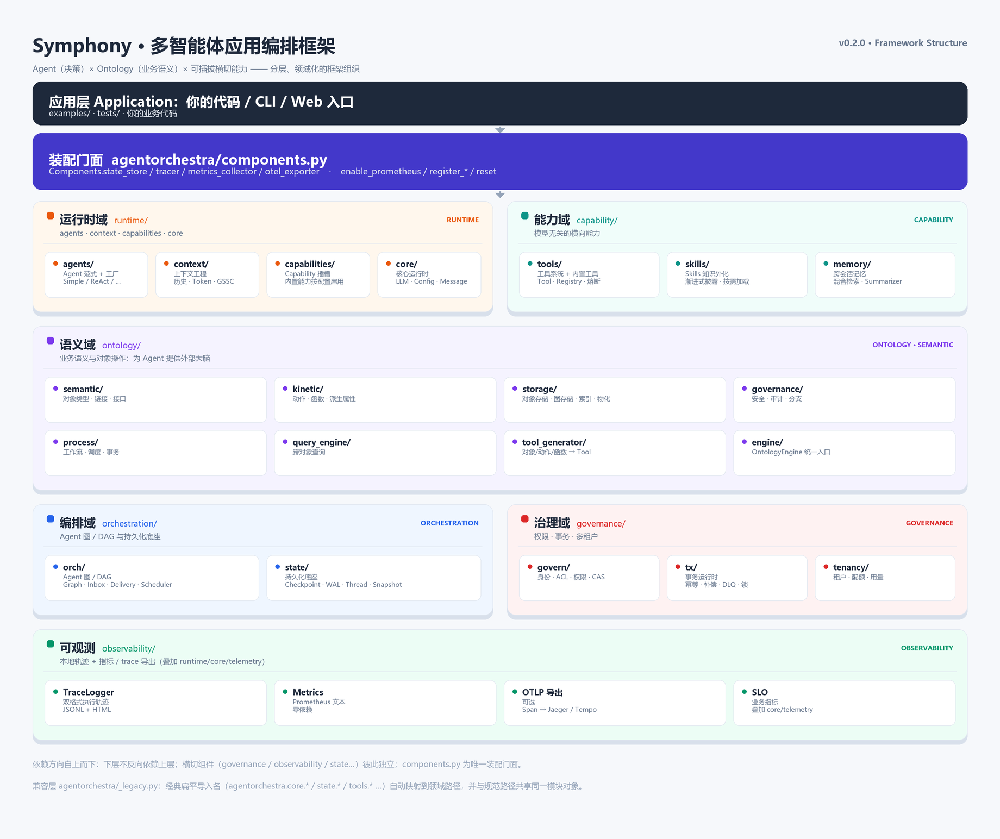

# 架构总览（Architecture）

> agentorchestra v0.2.0 的领域化架构导览：源码按“运行时 / 能力 / 语义 / 编排 / 治理 / 可观测”六个领域物理分域，由统一装配门面 `Components`（`agentorchestra/components.py`）对外暴露横切组件，并以 `_legacy.py` 兼容层保留经典扁平导入名。本页说明分层模型、目录映射、依赖方向、装配扩展点与阅读指引。

---

## 整体架构：分层模型与领域目录映射

包名 `agentorchestra`（`pyproject.toml`，Python >= 3.10，MIT）以**领域**而不是技术层次划分源码。从“用户代码”到“数据/外部系统”，大致呈现如下堆叠关系；越靠近顶部越贴近业务，越靠近底部越是基础底座，横切能力（治理 / 可观测 / 装配）以独立包或门面存在：

```
┌────────────────────────────────────────────────────────────────────┐
│  应用层 Application：你的代码 / CLI / Web 入口（examples/、tests/）      │
├────────────────────────────────────────────────────────────────────┤
│  装配门面  agentorchestra/components.py                              │
│            Components.state_store / tracer / metrics_collector /     │
│            otel_exporter · enable_prometheus / register_* / reset    │
├─────────────────────────────┬──────────────────────────────────────┤
│  运行时域 runtime/            │  agents/         Agent 范式 + 工厂       │
│                             │  context/        上下文工程（历史/Token） │
│                             │  capabilities/   Capability 特性插槽     │
│                             │  core/           LLM · Config · Message │
│                             │                  · reliability · telemetry
├─────────────────────────────┼──────────────────────────────────────┤
│  能力域 capability/           │  tools/   工具系统 + 内置工具 + 熔断      │
│                             │  skills/  Skills 知识外化                │
│                             │  memory/  跨会话记忆                     │
├─────────────────────────────┴──────────────────────────────────────┤
│  语义域 ontology/   semantic · kinetic · storage · governance ·        │
│                     process · query_engine · tool_generator · engine  │
├─────────────────────────────┬──────────────────────────────────────┤
│  编排域 orchestration/        │  orch/    Agent 图/DAG（Graph/Inbox/…）│
│                             │  state/    持久化底座（Checkpoint/WAL） │
├─────────────────────────────┼──────────────────────────────────────┤
│  治理域 governance/           │  govern/   身份 · ACL · 权限 · CAS      │
│                             │  tx/       事务（幂等/补偿/DLQ/乐观锁）   │
│                             │  tenancy/  租户 · 配额 · 用量           │
├─────────────────────────────┴──────────────────────────────────────┤
│  可观测 observability/   TraceLogger · Metrics(Prometheus 文本) ·      │
│                          OTLP 导出 · SLO（叠加 runtime/core/telemetry） │
└────────────────────────────────────────────────────────────────────┘
```

各领域一句话职责：

| 领域 | 目录 | 一句话职责 |
| --- | --- | --- |
| 运行时 | `runtime/` | 多智能体范式、核心基础件（LLM/配置/消息）、上下文工程与 Capability 插槽，是 Agent 程序运行的主体 |
| 能力 | `capability/` | 供 Agent 调用的“能力资产”：工具系统（含内置工具与熔断）、Skills 加载、跨会话记忆 |
| 语义 | `ontology/` | 业务对象 / 链接 / 动作 / 函数 / 接口的统一语义建模，及其存储、查询、治理（安全/审计/分支）与“一键生成 Tool” |
| 编排 | `orchestration/` | 多个 Agent 的图/DAG 通信（Graph/Inbox/事件）与运行状态持久化底座（Checkpoint/WAL/Interrupt） |
| 治理 | `governance/` | 跨模块横切治理：对象身份与权限、事务运行时、多租户与配额（详见 [docs/enterprise/README.md](../enterprise/README.md)） |
| 可观测 | `observability/` | 执行轨迹记录、指标（Prometheus 文本）、可选 OTLP 追踪与 SLO 指标定义 |

> 顶层还有两个“结构性”成员：`agentorchestra/components.py`（统一装配门面）与 `agentorchestra/_legacy.py`（经典导入兼容层）。它们不属于任何领域，专门承担“装配”与“兼容”两类横切职责。

---

## 设计动机与原则

### 为什么是“领域化 + 组件化 + 兼容层”

- **领域化（分域物理布局）**：重构前顶层是 `agents / core / context / tools / skills / memory / state / tx / tenancy / ontology / …` 的“扁平大杂烩”，难以判断一段代码“属于谁”。现在按业务领域落到 `runtime / capability / ontology / orchestration / governance / observability`，让职责就近内聚、依赖方向可推导。
- **组件化（横切组件可插拔）**：存储、追踪、指标、trace 导出这类“横切组件”如果散落在各业务包各自维护全局单例，装配与测试都会失控。`components.py` 把这些实现收敛到**一个入口**：全部懒加载、未注册时回退既有全局实现、可 `register_*` 覆盖、`reset()` 还原（测试用）。
- **兼容层（向后兼容）**：目录搬家不该让调用方跟着搬家。`_legacy.py` 用 MetaPathFinder + AliasLoader 把经典扁平导入名映射到新物理路径，经典名与新名得到**同一个模块对象**（类身份一致、不重复执行模块代码）。

### 分层依赖规则

约定如下，均可在代码里对照验证：

1. **上层可 import 下层，下层不得静态 import 上层**。例如 `ontology/`、`orchestration/`、`governance/` 都没有反向 import `runtime/agents`；`orchestration/orch/` 不依赖 `orchestration/state/`（store 通过构造参数注入）。
2. **基础件下沉**：`runtime/core/` 只定义 LLM 适配、`Config`（opt-in by default 的子配置）、`Message`、异常、可靠性（retry/ratelimit）与 telemetry 基础件，是其它领域的公共地基。
3. **横切组件独立、按需挂钩**：`governance/`、`observability/`、`ontology/governance/` 是独立包。跨域能力通过**函数内懒导入**在功能点挂钩，避免模块顶层成环——例如 `runtime/core/agent/base.py` 在需要时懒导入 `orchestration.state` 的 Checkpoint/WAL/Interrupt，`runtime/core/llm/__init__.py` 懒接入 `governance.tenancy` 的租户计费，`ontology/storage/` 懒读 `current_principal` 与 `TxConflict`。
4. **持久化底座只认抽象**：`governance/tx` 只依赖 `orchestration/state` 的 `CheckpointStore`/`records`/`wal` 接口，不关心具体后端是内存、SQLite 还是 PostgreSQL；真正驱动由 `orchestration/state/backends/` 提供，上层可通过 `get_default_store(db_url)` 选择。
5. **`components` 门面是唯一“知道全部”的地方**：`components.py` 只做聚合与委托（它引用了各领域的默认实现与 `enable_prometheus_collector`、`get_default_exporter` 等），业务包不直接持有“装配地图”。

### 向后兼容策略

- 顶层兼容映射见 `agentorchestra/_legacy.py::_LEGACY_TOP`：`agents → runtime.agents`、`context → runtime.context`、`core → runtime.core`、`tools → capability.tools`、`skills → capability.skills`、`memory → capability.memory`、`state → orchestration.state`、`tx → governance.tx`、`tenancy → governance.tenancy`。
- `runtime/core` 内被按职责归并的经典模块走 `_LEGACY_CORE` 细粒度映射（如 `core.hot_config → core.config.hot`、`core.tracing → core.telemetry.tracing`、`core.llm_adapters → core.llm.adapters`）。
- `governance` / `orchestration` 是“域包装包”：公共符号（`ACLManager`、`Graph` 等）由 `govern/` / `orch/` 子包再导出；经典深层路径（如 `orchestration.graph`）经 `_GOVERN_FLAT` / `_ORCH_FLAT` 映射到 `orch.graph` / `govern.acl`。
- 兼容层在 `agentorchestra/__init__.py` 导入早期自动安装（`install_legacy_aliases()`），并配合 `__getattr__` 懒暴露顶层经典名（`agentorchestra.core` 等）。详见下文“兼容层说明”。

---

## 这样设计的好处

1. **依赖方向一目了然**：分域后能快速回答“这段逻辑属于哪个领域、它允许依赖谁”，新代码按目录归属落位，减少“扁平包互相乱引”的蔓延。
2. **横切装配收敛、可测试**：存储/追踪/指标/导出统一走 `Components`，未装配可回退默认实现、测试可 `register_*` 注入替身再 `reset()`，避免全局单例散落各处。
3. **持久化后端可替换**：`orchestration/state` 提供 `memory / sqlite / postgres` 三种后端选择，事务、审计、图执行都以同一 `CheckpointStore` 抽象为底座，从“开发态内存/单文件”平滑切到“多实例共享存储”。
4. **默认安全、按需开启（opt-in）**：`Config` 的 feature flag 全部默认 `False`（trace/skills/mcp/ontology/state_checkpoint/memory 等），避免隐式文件扫描、磁盘持久化、外部服务等副作用；`development()` 只打开便于本地调试的几项，`production()` 保持核心最小集。
5. **平滑迁移不破坏调用方**：兼容层让经典导入名继续可用且与新物理路径共享同一模块对象，仓库内部与外部使用方可以按自己的节奏切换到规范路径（见根 [README](../../README.md) 与 `_legacy.py` 的说明）。
6. **语义与执行解耦**：`ontology` 只描述“业务对象/动作”，通过 `ToolGenerator` 生成标准 Tool 挂到任意 Agent 的 `ToolRegistry`，本体层不依赖具体 Agent 类型，业务语义可被不同范式复用。

---

## 模块全景与依赖方向

### 模块全景

| 领域 / 模块 | 位置 | 职责 | 主要能力 |
| --- | --- | --- | --- |
| 运行时·Agents | `runtime/agents/` | 多智能体范式实现 | `SimpleAgent` / `ReActAgent` / `ReflectionAgent` / `PlanSolveAgent` / `LoopAgent` + `factory` |
| 运行时·Core | `runtime/core/` | 公共基础件 | `llm/`(统一客户端·适配·guard) `config/`(Config+loader+hot) `message/`(session) `agent/`(base·lifecycle) `reliability/`(retry·ratelimit) `telemetry/`(tracing·metrics·logging·health·monitor) `exceptions` `utils` |
| 运行时·Context | `runtime/context/` | 上下文工程 | 历史管理、Token 计数、上下文构建、截断 |
| 运行时·Capabilities | `runtime/capabilities/` | Agent 特性插槽（Phase 2 演进） | `Capability` / `CapabilityContext` / `CapabilityRegistry`（trace、skills、ontology、checkpoint 等以特性形式注册） |
| 能力·Tools | `capability/tools/` | 工具系统 | `Tool`/`ToolRegistry`、`ToolResponse`/错误码、访问过滤（`ReadOnlyFilter` 等）、`CircuitBreaker`、内置工具（calculator/file/task/skill/mcp/todowrite/devlog） |
| 能力·Skills | `capability/skills/` | 知识外化 | Skill 加载与注册、元数据渐进披露 |
| 能力·Memory | `capability/memory/` | 跨会话记忆 | Manager、分级记忆、混合检索（关键词+向量）、Summarizer |
| 语义 | `ontology/` | 业务语义模型 | `semantic/`(ObjectType/LinkType/Interface/Vocabulary) `kinetic/`(ActionType/Function) `storage/`(ObjectStore/GraphStore/Index/物化/后端) `governance/`(SecurityManager/审计/分支) `process/`(Workflow/Scheduler/Transaction) `query_engine` `tool_generator` `engine`(OntologyEngine 统一入口) |
| 编排·图 | `orchestration/orch/` | Agent 图/DAG | `Graph`/节点（Agent/Router/Merge/Functional）、`Inbox`、`DeliveryManager`、`GraphScheduler`、事件模型 |
| 编排·状态 | `orchestration/state/` | 持久化与恢复底座 | `Checkpoint`/`CheckpointStore`、WAL、Thread、Interrupt(HITL)、Snapshot、`records`（含 `AuditEntry`/`DLQEntry`/`IdempotencyRecord`/`LockRecord`）、`backends/`(memory·sqlite·postgres) |
| 治理·权限 | `governance/govern/` | 对象身份与访问控制 | `IdentityService`/`IdentityContext`、`ACLManager`(行级)、`PermissionChecker`、`ObjectCAS`、`gdpr.py`(PII/数据主体工具，模块级，未在 `__init__` 导出) |
| 治理·事务 | `governance/tx/` | 事务运行时 | `TransactionCoordinator`、幂等、补偿、DLQ、乐观锁、TxActionLog(WAL)、`run_sync` 桥接、`isolation`(SSI 占位扩展点) |
| 治理·多租户 | `governance/tenancy/` | 租户隔离与配额 | `TenantManager`/`TenantContext`、`namespace_resource`/`enforce_tenant_access`、`QuotaManager`/`TokenQuota`、`UsageRecorder` |
| 可观测 | `observability/` | 运行诊断 | `TraceLogger`(JSONL+HTML)、Prometheus 文本收集器与 Counter/Gauge/Histogram、`OTLPHttpJsonExporter`(默认关)、SLO 定义；其 telemetry 基础来自 `runtime/core/telemetry/` |
| 装配门面 | `components.py` | 横切装配唯一入口 | `Components.state_store/tracer/metrics_collector/otel_exporter` + `register_*`/`enable_prometheus`/`enable_otel_trace`/`reset`/配置热更新 |
| 兼容层 | `_legacy.py` | 经典导入名 → 新物理路径 | MetaPathFinder + AliasLoader，映射表见模块 docstring |

### 关键依赖方向

| 谁 | 依赖谁 | 说明 / 约束 |
| --- | --- | --- |
| `runtime/agents` | `runtime/core`、`capability/tools` | Agent 建在 core 之上，通过 `ToolRegistry` 调用工具；不依赖 ontology/governance 具体实现 |
| `ontology/` | `capability/tools`（`Tool`/`ToolRegistry`/响应协议） | `tool_generator` 与 `engine.mount(registry)` 只为生成并挂载工具；**不依赖具体 Agent**。另有懒 import 接 telemetry metrics、governance 身份/事务与 state 审计记录 |
| `orchestration/orch/` | —（独立） | `orch` 不静态依赖 `state`/`governance`/`capability`；store/Inbox 依赖通过构造参数注入 |
| `orchestration/state/` | 仅自身 `backends/` + SQLAlchemy 驱动 | **仅依赖核心与存储层**，是全库最干净的持久化底座；被 agent 持久化、tx、审计复用 |
| `governance/tx` | `orchestration/state`（records/wal/CheckpointStore 抽象） | 幂等/锁/DLQ/动作日志都落到 state 的存储接口，后端由 `state.backends` 提供 |
| `governance/govern` | `ontology/governance`（可选） | `PermissionChecker.check` 在传入 RBAC `SecurityManager` 时复用 `ontology.governance.SecurityContext`；`ACLManager`/`IdentityService` 自包含内存实现 |
| `observability/` | `runtime/core`（utils、telemetry.tracing 的 Span/Exporter 协议） | 顶层可观测包基于 core telemetry 基础件实现导出能力 |
| `runtime/core/agent`、`runtime/core/llm` | `orchestration/state`、`governance/tenancy`（**懒 import**） | 持久化循环与租户计费在功能点挂钩；这是“核心不得静态依赖上层”规则下刻意保留的收敛点 |
| `components.py` | 全部领域 | 唯一知道横切组件“默认实现 / 可替换实现 / 装配组合”的门面；业务包不直接持有装配地图 |

---

## 装配与扩展点

横切组件一律通过 `agentorchestra.components` 装配。所有 getter 均为**懒加载**：未显式注册时回退到各领域的既有全局实现，因此“不装配也能跑”。

```python
from agentorchestra.components import Components

# —— 读取（默认回退全局实现，无需先装配）——
store     = Components.state_store()            # 回退 orchestration.state.get_default_store()
tracer    = Components.tracer()                 # 回退 runtime.core.telemetry.tracing.get_tracer
collector = Components.metrics_collector()      # 回退 observability.metrics.get_default_collector
exporter  = Components.otel_exporter()          # 回退 observability.otel_exporter.get_default_exporter

# —— 替换（可插拔）：注入返回实现/工厂，调用方无感 ——
Components.register_state_store(lambda: my_store)
Components.register_tracer(my_tracer_factory)
Components.register_metrics_collector(my_collector_factory)
Components.register_otel_exporter(my_exporter_factory)

# —— 装配常用组合（幂等）——
Components.enable_prometheus()                   # 开启 Prometheus 文本指标收集器
Components.enable_otel_trace(                    # 开启 OTLP trace 导出（端点须可达）
    endpoint="http://jaeger:4318",
    service_name="agentorchestra",
)

# —— 配置热更新（轮询 + 全局回调）——
Components.on_config_change(lambda old_cfg, new_cfg: handle(old_cfg, new_cfg))
Components.start_hot_reload("config.json", poll_interval=2.0)  # 返回 ConfigWatch
Components.stop_hot_reload()

# —— 清理 / 还原（测试与装配变更）——
Components.reset()      # 清空全部注册并还原 observability 默认 NoOp 收集器
```

扩展点归纳：持久化后端（选 `sqlite` / `postgres` / `in_memory`，见 `orchestration/state.get_default_store` 与 [docs/state/README.md](../state/README.md)）、指标收集器、trace 导出器、全局 Tracer、配置热更新回调，以及 `Capability` 插槽（`runtime/capabilities/`）。逐项启用的“上线路线”见 [docs/enterprise/README.md](../enterprise/README.md)。

---

## 兼容层说明

`agentorchestra/_legacy.py` 维护“经典扁平导入名 → 领域化规范路径”的映射；`agentorchestra/__init__.py` 导入早期即调用 `install_legacy_aliases()` 安装兼容 Finder。映射命中时，导入走经典名与走规范名得到的是**同一个模块对象**。

| 经典导入（仍可用） | 规范物理路径 |
| --- | --- |
| `agentorchestra.agents` | `agentorchestra.runtime.agents` |
| `agentorchestra.context` | `agentorchestra.runtime.context` |
| `agentorchestra.core` | `agentorchestra.runtime.core` |
| `agentorchestra.tools` | `agentorchestra.capability.tools` |
| `agentorchestra.skills` | `agentorchestra.capability.skills` |
| `agentorchestra.memory` | `agentorchestra.capability.memory` |
| `agentorchestra.state` | `agentorchestra.orchestration.state` |
| `agentorchestra.tx` | `agentorchestra.governance.tx` |
| `agentorchestra.tenancy` | `agentorchestra.governance.tenancy` |
| `agentorchestra.orchestration.graph` | `agentorchestra.orchestration.orch.graph` |
| `agentorchestra.governance.acl` | `agentorchestra.governance.govern.acl` |
| `agentorchestra.core.tracing` | `agentorchestra.runtime.core.telemetry.tracing` |
| `agentorchestra.core.hot_config` | `agentorchestra.runtime.core.config.hot` |
| `agentorchestra.core.llm_adapters` | `agentorchestra.runtime.core.llm.adapters` |

```python
# 经典扁平导入（兼容层自动映射）
from agentorchestra.tools import ToolRegistry
from agentorchestra.state import get_default_store
from agentorchestra.tx import TransactionCoordinator
from agentorchestra.orchestration.graph import Graph

# 等价的新规范路径
from agentorchestra.capability.tools import ToolRegistry
from agentorchestra.orchestration.state import get_default_store
from agentorchestra.governance.tx import TransactionCoordinator
from agentorchestra.orchestration.orch.graph import Graph
```

机制要点（`_legacy.py`）：

- `_LegacyAliasFinder`（MetaPathFinder）优先于 `PathFinder` 拦截经典路径，经 `_guess()` 解析完整模块名（覆盖 `_LEGACY_TOP` 顶层映射、`_LEGACY_CORE` 细粒度映射、`_GOVERN_FLAT`/`_ORCH_FLAT` 域内扁平映射）。
- 命中后返回 `_AliasLoader`：它 `import` 规范模块并把 `sys.modules[别名]` 指向该对象，同时尝试把别名挂到父包属性，因此 `import agentorchestra.governance.acl as a` 与 `import agentorchestra.governance.govern.acl as b` 得到 `a is b == True`（不重复执行模块代码）。
- 未命中映射或规范模块不存在的路径照常走原生导入；Finder 安装幂等（重复调用直接返回）。

---

## 使用说明 / 开始阅读指引

### 建议阅读顺序

1. 根 [README.md](../../README.md)：快速开始、公共 API、顶层目录说明；
2. [docs/README.md](../README.md)：模块总览入口（该文件与各模块文档保持同步更新）；
3. **本页**（架构总览）后，按依赖自底向上：
   - 运行时基础件：[runtime](../runtime/README.md)、[core](../core/README.md)、[context](../context/README.md)；
   - Agent 与能力：[agents](../agents/README.md)、[tools](../tools/README.md)、[memory](../memory/README.md)；
   - 业务语义：[ontology](../ontology/README.md)；
   - 编排与状态：[orchestration](../orchestration/README.md)、[state](../state/README.md)；
   - 治理与多租户：[tx](../tx/README.md)、[governance](../governance/README.md)、[tenancy](../tenancy/README.md)；
   - 可观测：[observability](../observability/README.md)；
4. 上线 / 演进视角：[enterprise（跨模块横切能力与上线指南）](../enterprise/README.md)。

### 运行测试与质量命令

```bash
pip install -e ".[dev]"        # 开发依赖：pytest / ruff / mypy 等
pytest tests                   # pytest.ini 已配 testpaths=tests、asyncio_mode=auto
ruff check agentorchestra      # 代码风格（select E/F/W/I，line-length=100，__init__.py 豁免 E402）
mypy agentorchestra            # 类型检查（可选；dev 依赖含 mypy）
```

仓库自带测试位于 `tests/unit`、`tests/integration`、`tests/stress`（`slow`/`stress`/`integration`/`unit` 分组标记）。

### 各模块文档

| 模块 | 文档 |
| --- | --- |
| 运行时总览 | [docs/runtime/README.md](../runtime/README.md) |
| Agent | [docs/agents/README.md](../agents/README.md) |
| 核心基础件 | [docs/core/README.md](../core/README.md) |
| 上下文工程 | [docs/context/README.md](../context/README.md) |
| 工具 | [docs/tools/README.md](../tools/README.md) |
| 记忆 | [docs/memory/README.md](../memory/README.md) |
| Ontology | [docs/ontology/README.md](../ontology/README.md) |
| 编排（图通信） | [docs/orchestration/README.md](../orchestration/README.md) |
| 持久化与恢复（state） | [docs/state/README.md](../state/README.md) |
| 事务运行时（tx） | [docs/tx/README.md](../tx/README.md) |
| 治理（权限/审计） | [docs/governance/README.md](../governance/README.md) |
| 多租户与配额 | [docs/tenancy/README.md](../tenancy/README.md) |
| 可观测性 | [docs/observability/README.md](../observability/README.md) |
| 横切能力与上线/演进指南 | [docs/enterprise/README.md](../enterprise/README.md) |

## 框架结构图

> 结构定稿，与当前源码领域目录一一对应。


